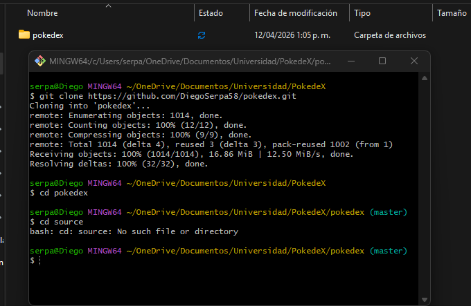
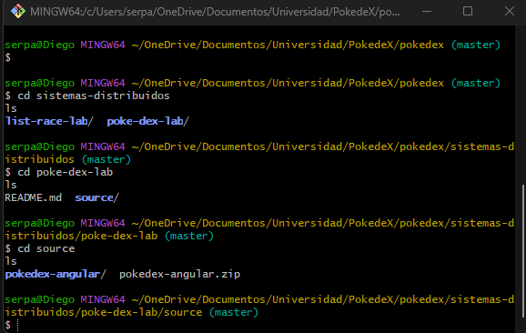
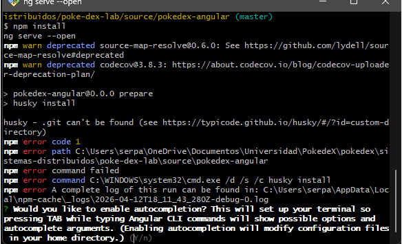
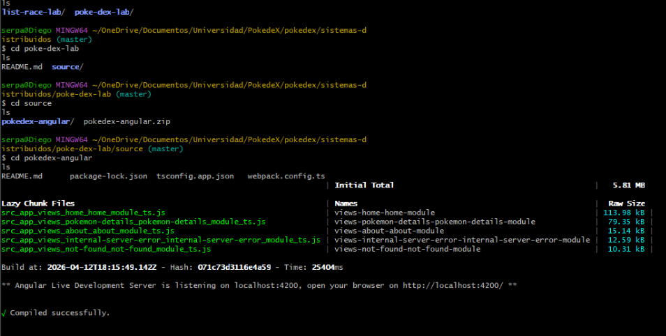
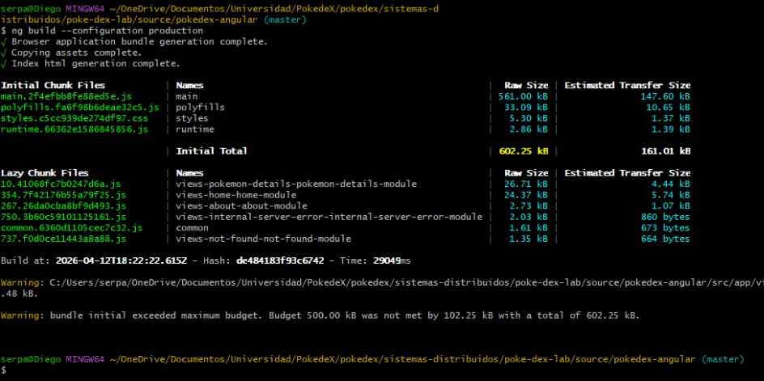
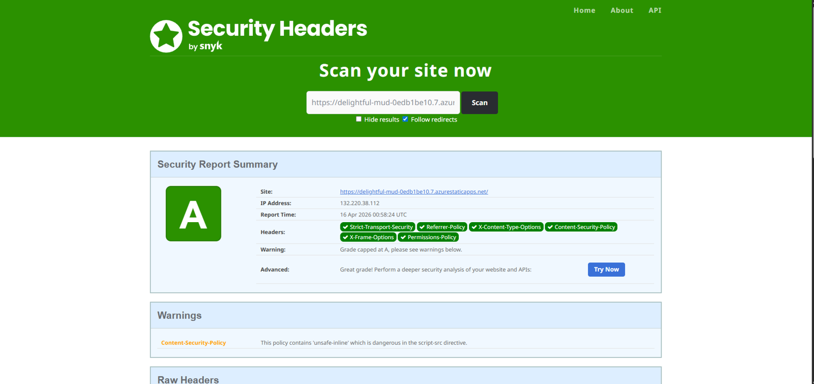
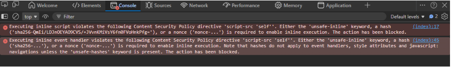
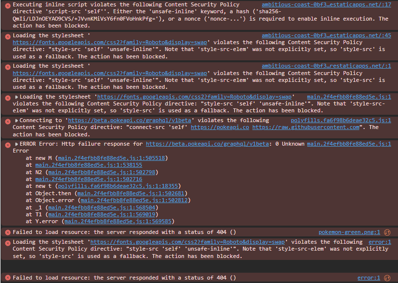
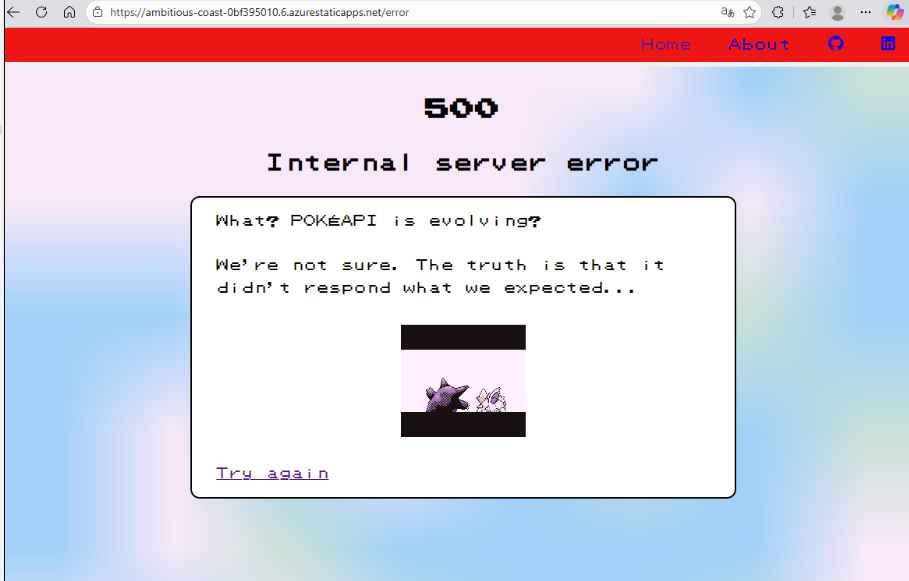
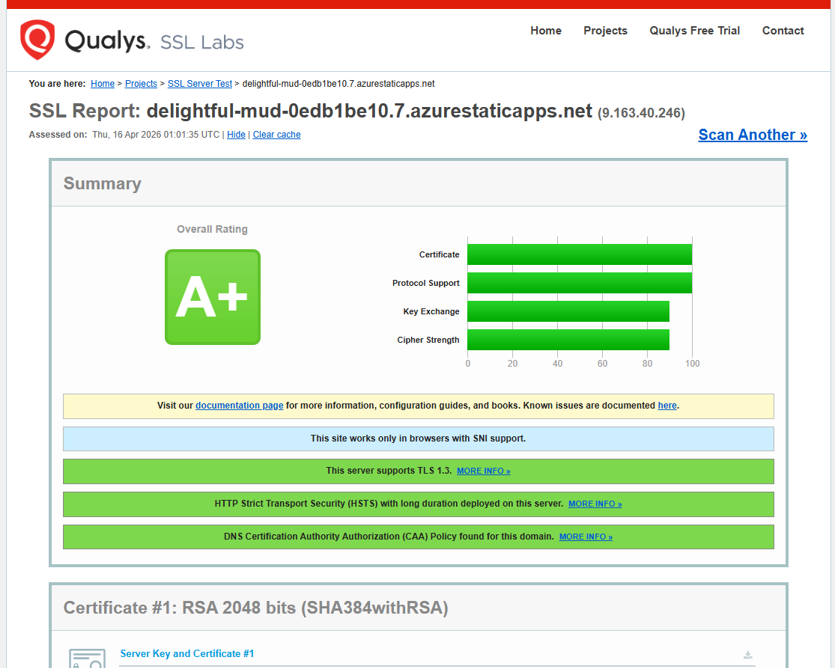

# Pokédex Angular – Despliegue en Azure Static Web Apps

Este repositorio contiene diferentes workshops de tecnologías.  
Dentro de ellos se encuentra la **Pokédex Angular**, una aplicación web que consume la PokéAPI y muestra la Pokédex de las versiones clásicas (Green, Red & Blue, Yellow, etc.).

---

## 🧩 Proyecto de la Pokédex

- **Framework:** Angular
- **Lenguajes principales:** TypeScript, HTML, CSS/SCSS
- **API externa:** [PokéAPI](https://pokeapi.co/)
- **Despliegue en producción:** Azure Static Web Apps
- **Repositorio original del profesor:** `keilermora/pokedex-angular` (forkeado en este repo)

### URL de la aplicación en producción

- **Producción:**  
  `https://delightful-mud-0edb1be10.7.azurestaticapps.net`

---

## ▶️ Ejecución en local




Dentro de la carpeta del proyecto Angular:

```bash
cd sistemas-distribuidos/poke-dex-lab/source/pokedex-angular

# Instalar dependencias
npm install

# Ejecutar en modo desarrollo
npm start
# o
ng serve --open
```

La aplicación quedará disponible en:

- `http://localhost:4200/`


### Build de producción

```bash
ng build --configuration production
```

El paquete generado se crea en:

- `dist/pokedex-angular`


---

## ☁️ Despliegue en Azure Static Web Apps

1. **Fork del repositorio del profesor** hacia `DiegoSerpa58/Pokedex`.
2. **Creación del recurso en Azure Portal**:
   - Tipo de recurso: **Static Web App**
   - Plan: Azure for Students
   - Nombre de recurso (ejemplo): `pokedex-diego`
   - Resource group: `rg-pokedex`
   - Source: **GitHub**
   - Repositorio: `DiegoSerpa58/Pokedex`
   - Branch: `master`
   - App location:  
     `sistemas-distribuidos/poke-dex-lab/source/pokedex-angular`
   - Output location:  
     `dist/pokedex-angular`
3. **GitHub Actions**:
   - Azure creó automáticamente un workflow en `.github/workflows/`.
   - Cada vez que se hace un commit en `master`, se ejecuta:
     - `npm install`
     - `ng build --configuration production`
     - Publicación en Azure Static Web Apps.

---

## 🔐 Encabezados de seguridad

Para cumplir con los requisitos de seguridad se creó el archivo:

- `sistemas-distribuidos/poke-dex-lab/source/pokedex-angular/staticwebapp.config.json`

Con el siguiente contenido final:

```json
{
  "globalHeaders": {
    "Content-Security-Policy": "default-src 'self'; script-src 'self' 'unsafe-inline'; style-src 'self' 'unsafe-inline' https://fonts.googleapis.com; style-src-elem 'self' 'unsafe-inline' https://fonts.googleapis.com; font-src 'self' https://fonts.gstatic.com data:; img-src 'self' data: https://raw.githubusercontent.com https://pokeapi.co https://assets.pokemon.com https://beta.pokeapi.co; connect-src 'self' https://pokeapi.co https://beta.pokeapi.co https://beta.pokeapi.co/graphql/v1beta; object-src 'none'; base-uri 'self'; form-action 'self'; frame-ancestors 'none'; upgrade-insecure-requests",
    "Strict-Transport-Security": "max-age=31536000; includeSubDomains; preload",
    "X-Content-Type-Options": "nosniff",
    "X-Frame-Options": "DENY",
    "Referrer-Policy": "no-referrer",
    "Permissions-Policy": "camera=(), microphone=(), geolocation=(), payment=()",
    "X-XSS-Protection": "1; mode=block"
  },
  "navigationFallback": {
    "rewrite": "/index.html",
    "exclude": ["/images/*.{png,jpg,gif,svg}", "/css/*", "/js/*"]
  }
}
```

### Headers configurados

- **Content-Security-Policy (CSP)**  
  Limita de dónde se pueden cargar recursos (scripts, estilos, imágenes, llamadas a APIs).  
  En este caso:
  - `default-src 'self'`
  - `script-src 'self' 'unsafe-inline'` para permitir los scripts inline que ya trae la aplicación original, evitando errores en la consola.
  - Estilos y fuentes:
    - `style-src` / `style-src-elem` permiten estilos inline y `https://fonts.googleapis.com`.
    - `font-src` permite `self`, `https://fonts.gstatic.com` y `data:`.
  - Imágenes limitadas a:
    - `self`, `data:`, `https://raw.githubusercontent.com`, `https://pokeapi.co`, `https://assets.pokemon.com`, `https://beta.pokeapi.co`.
  - Conexiones (`connect-src`) limitadas a PokéAPI y su endpoint GraphQL.
  - Otros refuerzos:
    - `object-src 'none'`, `base-uri 'self'`, `form-action 'self'`, `frame-ancestors 'none'`, `upgrade-insecure-requests`.

- **Strict-Transport-Security**  
  Obliga al navegador a usar **HTTPS** durante 1 año y para subdominios (`includeSubDomains; preload`).

- **X-Content-Type-Options: nosniff**  
  Evita que el navegador intente adivinar el tipo de contenido (previene ataques basados en MIME sniffing).

- **X-Frame-Options: DENY**  
  Impide que la app se cargue en iframes de otros sitios (prevención de clickjacking).

- **Referrer-Policy: no-referrer**  
  No envía la URL de origen en la cabecera `Referer`, reduciendo la fuga de información.

- **Permissions-Policy**  
  Deshabilita el acceso a APIs de navegador que no se usan en esta app:
  - `geolocation`
  - `microphone`
  - `camera`
  - `payment`

- **X-XSS-Protection**  
  Activa el filtro XSS heredado en navegadores que todavía lo soportan (`1; mode=block`).

---

## 🛡️ Resultados de SecurityHeaders.com

Se utilizó [securityheaders.com](https://securityheaders.com/) para validar los encabezados.


- **Calificación estable usada en producción:** **A**
- Encabezados en verde:
  - `Content-Security-Policy`
  - `Strict-Transport-Security`
  - `X-Content-Type-Options`
  - `X-Frame-Options`
  - `Referrer-Policy`
  - `Permissions-Policy`
  - `X-XSS-Protection`

Durante las pruebas se endureció la `Content-Security-Policy` eliminando `'unsafe-inline'` de `script-src` (dejando `script-src 'self'`), lo que permitió alcanzar momentáneamente una calificación **A+** en securityheaders.com.  
Sin embargo, esa política tan estricta bloqueaba scripts y manejadores de eventos inline que usa la aplicación original y generaba mensajes de error CSP en la consola del navegador. Para cumplir con el requisito del laboratorio de **no tener errores en la consola**, se decidió volver a una versión ligeramente más permisiva de la CSP (permitiendo inline scripts de forma controlada con `'unsafe-inline'`), manteniendo la calificación **A** en securityheaders y una consola completamente limpia.

---

## 🐞 Errores corregidos durante el despliegue

### 1. Content-Security-Policy bloqueando recursos

Al principio la CSP bloqueaba:

- Fuentes de Google (`fonts.googleapis.com`, `fonts.gstatic.com`).
- Peticiones a `https://beta.pokeapi.co/graphql/v1beta`.

**Solución:**  
Se ajustó la cabecera CSP en `staticwebapp.config.json` para permitir:

- `style-src 'self' 'unsafe-inline' https://fonts.googleapis.com`
- `style-src-elem 'self' 'unsafe-inline' https://fonts.googleapis.com`
- `font-src 'self' https://fonts.gstatic.com data:`
- `connect-src 'self' https://pokeapi.co https://beta.pokeapi.co https://beta.pokeapi.co/graphql/v1beta`

Con esto la Pokédex volvió a funcionar correctamente en Azure.

### 2. Imágenes 404 solo en producción (`imagesPath` distinto)

En la consola del navegador aparecía:


  
```text
GET https://.../pokedex-angular/assets/images/pokemon-green.png 404 (Not Found)
```

En el código se encontró:

```ts
// environment.prod.ts (original)
imagesPath: '/pokedex-angular/assets/images',
```

mientras que en desarrollo (`environment.ts`) estaba:

```ts
imagesPath: '/assets/images',
```

Esto provocaba que en producción las URLs de sprites fueran incorrectas.

**Solución:**  
Se unificó la configuración de imágenes en producción:

```ts
// environment.prod.ts corregido
export const environment = {
  production: true,
  pokeApi: 'https://pokeapi.co/api/v2',
  pokeApiGraphQL: 'https://beta.pokeapi.co/graphql/v1beta',
  homeAngular: 'https://angular.io/',
  homePokeApi: 'https://pokeapi.co/',
  keilerLinkedin: 'https://www.linkedin.com/in/keilermora/',
  pokedexGithub: 'https://github.com/keilermora/pokedex-angular',
  imagesPath: '/assets/images',
  language: 'en',
  languageId: 9,
};
```

Tras este cambio:

- Las rutas a imágenes funcionan en Azure.
- La consola queda **sin errores** (ni 404 ni CSP).

---

## 🔬 Desafío Maestro – Auditoría SSL con SSL Labs

Como parte del desafío maestro se realizó una auditoría adicional de seguridad usando **Qualys SSL Labs** sobre la URL pública de la aplicación:

- URL analizada: `https://delightful-mud-0edb1be10.7.azurestaticapps.net`
- Herramienta: [SSL Labs – SSL Server Test](https://www.ssllabs.com/ssltest/)

### Resultados principales

- **Calificación general:** **A+**.
- Certificado TLS válido emitido para `*.azurestaticapps.net`.
- Soporte de **TLS 1.3** y suites criptográficas modernas.
- `HTTP Strict Transport Security (HSTS)` activo con duración larga.
- Política CAA configurada correctamente para el dominio.

No se detectaron vulnerabilidades críticas relacionadas con el canal seguro (SSL/TLS).  
Esto confirma que, además de los encabezados HTTP de seguridad configurados en `staticwebapp.config.json`, la plataforma de Azure Static Web Apps proporciona una configuración robusta de TLS por defecto.


---

## 📌 Reflexión Técnica

1. **¿Qué vulnerabilidades previenen los encabezados implementados?**  
   - `Content-Security-Policy` ayuda a mitigar ataques de Cross-Site Scripting (XSS) al limitar desde qué orígenes se pueden cargar scripts, estilos e imágenes.  
   - `Strict-Transport-Security` fuerza el uso de HTTPS y reduce el riesgo de ataques de tipo man-in-the-middle.  
   - `X-Content-Type-Options: nosniff` evita que el navegador interprete archivos con un tipo de contenido diferente al declarado (previniendo ciertos ataques basados en MIME).  
   - `X-Frame-Options: DENY` protege contra ataques de clickjacking al impedir que la aplicación se cargue dentro de iframes externos.  
   - `Referrer-Policy: no-referrer` minimiza la fuga de información sensible en la cabecera `Referer`.  
   - `Permissions-Policy` restringe el acceso a APIs del navegador (geolocalización, cámara, micrófono, pago) que la aplicación no necesita, reduciendo la superficie de ataque.  
   - `X-XSS-Protection` activa el filtro XSS heredado en navegadores antiguos que todavía lo soportan.

2. **¿Qué aprendiste sobre la relación entre despliegue y seguridad web?**  
   Aprendí que desplegar una aplicación no es solo “subir archivos”, sino configurar correctamente el entorno de producción. Pequeñas diferencias entre `environment.ts` y `environment.prod.ts` (como la ruta de `imagesPath`) pueden generar errores solo en la nube. También vi que la seguridad se configura a nivel de servidor o plataforma (en este caso Azure Static Web Apps) mediante encabezados HTTP, y que herramientas como *securityheaders.com* y *SSL Labs* permiten validar rápidamente si estas protecciones están bien aplicadas.

3. **¿Qué desafíos encontraste en el proceso?**  
   El principal desafío fue depurar errores que solo aparecían en producción: primero la CSP bloqueaba fuentes y llamadas a la PokéAPI, provocando una pantalla de error 500 en la Pokédex. Luego aparecieron errores 404 de imágenes porque en producción `imagesPath` apuntaba a `/pokedex-angular/assets/images`, mientras que las imágenes reales estaban en `/assets/images`.  
   Además, al intentar endurecer aún más la CSP para llegar a **A+** en securityheaders, se bloquearon scripts inline y aparecieron errores CSP en la consola. Esto obligó a encontrar un equilibrio entre seguridad y funcionalidad, ajustando la política para mantener una nota **A** en securityheaders pero con la consola totalmente limpia. Al final, la aplicación quedó funcional, con encabezados de seguridad sólidos, A en SecurityHeaders y A+ en SSL Labs.
